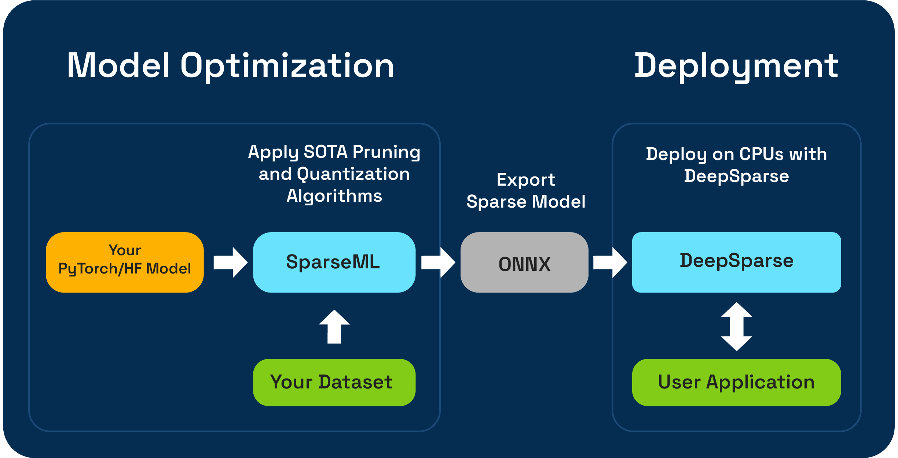

<!--
Copyright (c) 2021 - present / Neuralmagic, Inc. All Rights Reserved.

Licensed under the Apache License, Version 2.0 (the "License");
you may not use this file except in compliance with the License.
You may obtain a copy of the License at

   http://www.apache.org/licenses/LICENSE-2.0

Unless required by applicable law or agreed to in writing,
software distributed under the License is distributed on an "AS IS" BASIS,
WITHOUT WARRANTIES OR CONDITIONS OF ANY KIND, either express or implied.
See the License for the specific language governing permissions and
limitations under the License.
-->

<h1>&nbsp;&nbsp;SparseML</h1>

<h3>Libraries for applying sparsification recipes to neural networks with a few lines of code, enabling faster and smaller models</h3>

<p>
    <a href="https://docs.neuralmagic.com/sparseml/">
        
    </a>
    <a href="https://join.slack.com/t/discuss-neuralmagic/shared_invite/zt-q1a1cnvo-YBoICSIw3L1dmQpjBeDurQ/">
        
    </a>
    <a href="https://github.com/neuralmagic/sparseml/issues">
        
    </a>
    <a href="https://github.com/neuralmagic/sparseml/actions/workflows/test-check.yaml">
        
    </a>
    <a href="https://github.com/neuralmagic/sparseml/releases">
        
    </a>
    <a href="https://github.com/neuralmagic/sparseml/blob/main/LICENSE">
        
    </a>
    <a href="https://github.com/neuralmagic/sparseml/blob/main/CODE_OF_CONDUCT.md">
        
    </a>
    <a href="https://www.youtube.com/channel/UCo8dO_WMGYbWCRnj_Dxr4EA">
        
    </a>
     <a href="https://medium.com/limitlessai">
        
    </a>
    <a href="https://twitter.com/neuralmagic">
        
    </a>
</p>

## Overview

SparseML is an open-source model optimization toolkit that enables you to create inference-optimized sparse models using pruning, quantization, and distillation algorithms. Models optimized with SparseML can then be exported to the ONNX and deployed with [DeepSparse](https://github.com/neuralmagic/deepsparse/) for GPU-class performance on CPU hardware.

<p align="center">
   
</p>

## ✨NEW✨ SparseML One-Shot LLM Compression

Neural Magic is excited to preview one-shot LLM compression workflows using the new `SparseGPTModfier`! 

To prune and quantize a TinyLlama Chat model it is just a few steps to install dependencies, download a recipe, and apply it to the model:
```
git clone https://github.com/neuralmagic/sparseml
pip install -e "sparseml[transformers]"
wget https://huggingface.co/neuralmagic/TinyLlama-1.1B-Chat-v0.4-pruned50-quant-ds/raw/main/recipe.yaml
python sparseml/src/sparseml/transformers/sparsification/obcq/obcq.py TinyLlama/TinyLlama-1.1B-Chat-v0.4 open_platypus --recipe recipe.yaml --save True
```

The README at [`src/sparseml/transformers/sparsification/obcq`](https://github.com/neuralmagic/sparseml/tree/main/src/sparseml/transformers/sparsification/obcq) has a detailed walkthrough.

## Workflows

SparseML enables you to create a sparse model trained on your dataset in two ways:
- **Sparse Transfer Learning** enables you to fine-tune a pre-sparsified model from [SparseZoo](https://sparsezoo.neuralmagic.com/) (an open-source repository of sparse models such as BERT, YOLOv5, and ResNet-50) onto your dataset, while maintaining sparsity. This pathway works just like typical fine-tuning you are used to in training CV and NLP models, and is strongly preferred for if your model architecture is available in SparseZoo.

- **Sparsification from Scratch** enables you to apply state-of-the-art pruning (like gradual magnitude pruning or OBS pruning) and quantization (like quantization aware training) algorithms to arbitrary PyTorch and Hugging Face models. This pathway requires more experimentation, but allows you to create a sparse version of any model. 

## Integrations

<p>
    <a href="integrations/torchvision">
        
    </a>
    <a href="integrations/ultralytics-yolov5">
        
    </a>
    <a href="integrations/ultralytics-yolov8">
        
    </a>
    <a href="integrations/huggingface-transformers">
        
    </a>
</p>

## Tutorials

### PyTorch
- [Sparse Transfer Learning with the CLI](integrations/torchvision/tutorials/sparse-transfer-learning.md)
- [Sparse Transfer Learning with the Python API](integrations/torchvision/tutorials/docs-torchvision-python-transfer-imagenette.ipynb)
- [Sparsify From Scratch with the Python API](integrations/torchvision/tutorials/docs-torchvision-sparsify-from-scratch-resnet50-beans.ipynb)

### Hugging Face Transformers
- [Sparse Transfer Learning Overview with the Python API](integrations/huggingface-transformers/tutorials/sparse-transfer-learning-bert-python.md)
- [Sparse Transfer Learning Overview with the CLI](integrations/huggingface-transformers/tutorials/sparse-transfer-learning-bert.md)
- [Sparse Transfer Learning for Sentiment Analysis](integrations/huggingface-transformers/tutorials/sentiment-analysis/sentiment-analysis-cli.md), [for Text Classification](integrations/huggingface-transformers/tutorials/text-classification/text-classification-cli.md), [for Token Classification](integrations/huggingface-transformers/tutorials/token-classification/token-classification-cli.md), [for Question Answering](integrations/huggingface-transformers/tutorials/question-answering/question-answering-cli.md)

### Ultralytics YOLOv5
- [Sparse Transfer Learning With the CLI](integrations/ultralytics-yolov5/tutorials/sparse-transfer-learning.md)
- [Sparsify From Scratch With the CLI](integrations/ultralytics-yolov5/tutorials/sparsify-from-scratch.md)

### Ultralytics YOLOv8
- [Sparse Transfer Learning With the CLI](integrations/ultralytics-yolov8/tutorials/sparse-transfer-learning.md)

### Additional Examples

- [PyTorch](integrations/torchvision#tutorials)
- [Hugging Face Transformers](integrations/huggingface-transformers#tutorials)
- [Ultralytics YOLOv5](integrations/ultralytics-yolov5#tutorials)
- [Ultralytics YOLOv8](integrations/ultralytics-yolov8#tutorials)

## Installation

This repository is tested on Python 3.8-3.11, and Linux/Debian systems.

It is recommended to install in a [virtual environment](https://docs.python.org/3/library/venv.html) to keep your system in order.
Currently supported ML Frameworks are the following: `torch>=1.1.0,<=2.0`, `tensorflow>=1.8.0,<2.0.0`, `tensorflow.keras >= 2.2.0`.

Install with pip using:

```bash
pip install sparseml
```

More information on installation such as optional dependencies and requirements can be found [here](https://docs.neuralmagic.com/get-started/install/sparseml).

## Quick Tour

### Recipes

To enable flexibility, ease of use, and repeatability, SparseML uses a declarative interface called `recipes` for specifying the sparsity-related algorithms and hyperparameters that should be applied by SparseML.

`Recipes` are YAML-files formatted as a list of `modifiers`, which encode the instructions for SparseML. Example `modifiers` can be anything from setting the learning rate to encoding the hyperparameters of the gradual magnitude pruning algorithm. The SparseML system parses the `recipes` into a native format for each framework and applies the modifications to the model and training pipeline.

### Python API

Because of the declarative, recipe-based approach, you can add SparseML to your existing PyTorch training pipelines. The `ScheduleModifierManager` class is responsible for parsing the YAML `recipes` and overriding standard PyTorch model and optimizer objects, encoding the logic of the sparsity algorithms from the recipe. Once you call `manager.modify`, you can then use the model and optimizer as usual, as SparseML abstracts away the complexity of the sparsification algorithms.

The workflow looks like this:

```python
model = Model()            # model definition
optimizer = Optimizer()    # optimizer definition
train_data = TrainData()   # train data definition
batch_size = BATCH_SIZE    # training batch size
steps_per_epoch = len(train_data) // batch_size

from sparseml.pytorch.optim import ScheduledModifierManager
manager = ScheduledModifierManager.from_yaml(PATH_TO_RECIPE)
optimizer = manager.modify(model, optimizer, steps_per_epoch)

# typical PyTorch training loop, using your model/optimizer as usual

manager.finalize(model)
```

- Check out the [PyTorch integration docs](integrations/torchvision) for full usage examples of the Python API.
- Check out the [Hugging Face integration docs](integrations/huggingface-transformers) for details of using SparseML with the Hugging Face `Trainer`.

### SparseML CLI

In addition to the code-level API, SparseML offers pre-made training pipelines for common NLP and CV tasks via the CLI interface. The CLI enables you to kick-off training runs with various utilities like dataset loading and pre-processing, checkpoint saving, metric reporting, and logging handled for you. This makes it easy to get up and running in common training pathways.

For instance, we can use the following to kick off a YOLOv5 sparse transfer learning run onto the VOC dataset (using SparseZoo stubs to pull down a sparse model checkpoint and transfer learning recipe):

```bash
sparseml.yolov5.train \
  --weights zoo:cv/detection/yolov5-s/pytorch/ultralytics/coco/pruned75_quant-none?recipe_type=transfer_learn \
  --recipe zoo:cv/detection/yolov5-s/pytorch/ultralytics/coco/pruned75_quant-none?recipe_type=transfer_learn \
  --data VOC.yaml \
  --hyp hyps/hyp.finetune.yaml --cfg yolov5s.yaml --patience 0
```

- [YOLOv5 CLI](integrations/ultralytics-yolov5/tutorials/sparse-transfer-learning.md)
- [YOLOv8 CLI](integrations/ultralytics-yolov8/tutorials/sparse-transfer-learning.md)
- [Hugging Face CLI](integrations/huggingface-transformers/tutorials/sparse-transfer-learning-bert.md)
- [Torchvision CLI](integrations/torchvision/tutorials/sparse-transfer-learning.md)

### Additional Resources 

More information on the codebase and contained processes can be found in the SparseML docs:
- [Examples and Tutorials](integrations)
- [Sparsification Code](https://docs.neuralmagic.com/get-started/sparsify-a-model)
- [Sparsification Recipes](https://docs.neuralmagic.com/user-guides/recipes)
- [Exporting to ONNX](https://docs.neuralmagic.com/user-guides/onnx-export)

## Resources

### Learning More

- Documentation: [SparseML,](https://docs.neuralmagic.com/sparseml/) [SparseZoo,](https://docs.neuralmagic.com/sparsezoo/) [Sparsify,](https://docs.neuralmagic.com/sparsify/) [DeepSparse](https://docs.neuralmagic.com/deepsparse/)
- Neural Magic: [Blog,](https://www.neuralmagic.com/blog/) [Resources](https://www.neuralmagic.com/resources/)

### Release History

Official builds are hosted on PyPI

- stable: [sparseml](https://pypi.org/project/sparseml/)
- nightly (dev): [sparseml-nightly](https://pypi.org/project/sparseml-nightly/)

Additionally, more information can be found via [GitHub Releases.](https://github.com/neuralmagic/sparseml/releases)

### License

The project is licensed under the [Apache License Version 2.0.](https://github.com/neuralmagic/sparseml/blob/main/LICENSE)

## Community

### Contribute

We appreciate contributions to the code, examples, integrations, and documentation as well as bug reports and feature requests! [Learn how here.](https://github.com/neuralmagic/sparseml/blob/main/CONTRIBUTING.md)

### Join

For user help or questions about SparseML, sign up or log in to our [**Neural Magic Community Slack**](https://join.slack.com/t/discuss-neuralmagic/shared_invite/zt-q1a1cnvo-YBoICSIw3L1dmQpjBeDurQ). We are growing the community member by member and happy to see you there. Bugs, feature requests, or additional questions can also be posted to our [GitHub Issue Queue.](https://github.com/neuralmagic/sparseml/issues)

You can get the latest news, webinar and event invites, research papers, and other ML Performance tidbits by [subscribing](https://neuralmagic.com/subscribe/) to the Neural Magic community.

For more general questions about Neural Magic, please fill out this [form.](http://neuralmagic.com/contact/)

### Cite

Find this project useful in your research or other communications? Please consider citing:

```bibtex
@InProceedings{
    pmlr-v119-kurtz20a, 
    title = {Inducing and Exploiting Activation Sparsity for Fast Inference on Deep Neural Networks}, 
    author = {Kurtz, Mark and Kopinsky, Justin and Gelashvili, Rati and Matveev, Alexander and Carr, John and Goin, Michael and Leiserson, William and Moore, Sage and Nell, Bill and Shavit, Nir and Alistarh, Dan}, 
    booktitle = {Proceedings of the 37th International Conference on Machine Learning}, 
    pages = {5533--5543}, 
    year = {2020}, 
    editor = {Hal Daumé III and Aarti Singh}, 
    volume = {119}, 
    series = {Proceedings of Machine Learning Research}, 
    address = {Virtual}, 
    month = {13--18 Jul}, 
    publisher = {PMLR}, 
    pdf = {http://proceedings.mlr.press/v119/kurtz20a/kurtz20a.pdf},
    url = {http://proceedings.mlr.press/v119/kurtz20a.html}, 
    abstract = {Optimizing convolutional neural networks for fast inference has recently become an extremely active area of research. One of the go-to solutions in this context is weight pruning, which aims to reduce computational and memory footprint by removing large subsets of the connections in a neural network. Surprisingly, much less attention has been given to exploiting sparsity in the activation maps, which tend to be naturally sparse in many settings thanks to the structure of rectified linear (ReLU) activation functions. In this paper, we present an in-depth analysis of methods for maximizing the sparsity of the activations in a trained neural network, and show that, when coupled with an efficient sparse-input convolution algorithm, we can leverage this sparsity for significant performance gains. To induce highly sparse activation maps without accuracy loss, we introduce a new regularization technique, coupled with a new threshold-based sparsification method based on a parameterized activation function called Forced-Activation-Threshold Rectified Linear Unit (FATReLU). We examine the impact of our methods on popular image classification models, showing that most architectures can adapt to significantly sparser activation maps without any accuracy loss. Our second contribution is showing that these these compression gains can be translated into inference speedups: we provide a new algorithm to enable fast convolution operations over networks with sparse activations, and show that it can enable significant speedups for end-to-end inference on a range of popular models on the large-scale ImageNet image classification task on modern Intel CPUs, with little or no retraining cost.} 
}
```

```bibtex
@misc{
    singh2020woodfisher,
    title={WoodFisher: Efficient Second-Order Approximation for Neural Network Compression}, 
    author={Sidak Pal Singh and Dan Alistarh},
    year={2020},
    eprint={2004.14340},
    archivePrefix={arXiv},
    primaryClass={cs.LG}
}
```
