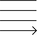

<!---
Copyright 2021 Neuralmagic, Inc. All rights reserved.

Licensed under the Apache License, Version 2.0 (the "License");
you may not use this file except in compliance with the License.
You may obtain a copy of the License at

    http://www.apache.org/licenses/LICENSE-2.0

Unless required by applicable law or agreed to in writing, software
distributed under the License is distributed on an "AS IS" BASIS,
WITHOUT WARRANTIES OR CONDITIONS OF ANY KIND, either express or implied.
See the License for the specific language governing permissions and
limitations under the License.
-->

#  SparseML

### Libraries and state-of-the-art automatic sparsification algorithms to simplify and accelerate performance

<p>
    <a href="https://github.com/neuralmagic/comingsoon/blob/master/LICENSE">
        
    </a>
    <a href="https://docs.neuralmagic.com/sparseml/">
        
    </a>
    <a href="https://github.com/neuralmagic/sparseml/releases">
        
    </a>
    <a href="https://github.com/neuralmagic.com/comingsoon/blob/master/CODE_OF_CONDUCT.md">
        
    </a>
     <a href="https://www.youtube.com/channel/UCo8dO_WMGYbWCRnj_Dxr4EA">
        
    </a>
     <a href="https://medium.com/limitlessai">
        
    </a>
    <a href="https://twitter.com/neuralmagic">
        
    </a>
 </p>

## Overview

SparseML is a toolkit that includes APIs, CLIs, scripts and libraries that take advantage of state-of-the-art algorithms in the fields of model pruning, quantization and transfer learning. The creation of performance-optimized models becomes simplified for the ML performance community at large. It’s meant for power users who want fine-grain control over model optimizations.

Implementations for multiple frameworks are provided including PyTorch, TensorFlow, and Keras.

## Quick Tour and Documentation

[TODO ENGINEERING: EDIT THE CONTENT PLACEHOLDERS AS NEEDED]

Follow the quick tour below to get started.
For a more in-depth read, check out [SparseML documentation](https://docs.neuralmagic.com/sparseml/).

<!--- the docs url will become active at CE Launch. --->

### Requirements

- This repository is tested on Python 3.6+, PyTorch base-ver+ and TensorFlow 1.x+
- Use Case: Computer Vision - Image Classification, Object Detection
- Model Architectures: Deep Learning Neural Network Architectures (e.g., CNNs, DNNs - refer to [SparseZoo](https://docs.neuralmagic.com/sparsezoo/) for examples)
- Instruction Set: CPUs with AVX2 or AVX-512 (best); (e.g., Intel Xeon Cascade Lake, Icelake, Skylake; AMD) and 2 FMAs. VNNI support required for sparse quantization.
- OS / Environment: Linux

### Usage

To use SparseML framework-specific tooling, the framework package(s) must already be installed in the environment.

The currently supported framework versions are:

- PyTorch supported versions: `>= 1.1.0, < 1.7.0`
- TensorFlow supported versions: >= `1.8.0` (TensorFlow >= `2.X` is not currently supported)

The following commands install versions of PyTorch and TensorFlow v1. For more installation details, see the [PyTorch](https://pytorch.org/get-started/locally/) and [TensorFlow](https://www.tensorflow.org/install/pip) websites.

```bash
pip3 install torch==1.5.0 torchvision==0.6.0
pip3 install tensorflow==1.15.0
```

### Installation

You should install SparseML in a [virtual environment](https://docs.python.org/3/library/venv.html). If you're unfamiliar with Python virtual environments, check out the [user guide](https://packaging.python.org/guides/installing-using-pip-and-virtual-environments/).

To install, run:

```bash
pip install sparseml
```

Optionally, SparseML can utiltize [Neural Magic's DeepSparse Engine](https://docs.neuralmagic.com/deepsparse/) and [Sparsify](https://docs.neuralmagic.com/sparsify/) in order to explore  faster inference timings. For example, after running a benchmark, you might want to change optimization values and run an optimization profile again. Visit their docs for install details.

## Tutorials

[SparseML Tutorials](notebooks/), which are implemented as Jupyter Notebooks for easy consumption and editing, are provided under the `notebooks` directory.

## Scripts

[SparseML Scripts](scripts/), which are implemented as functional scripts for working with the Python API,
are provided under the `scripts` directory. They cover ONNX, PyTorch, and TensorFlow models.
  
## Exporting to ONNX

[ONNX](https://onnx.ai/) is a generic format for storing neural networks that is supported natively or by third-party extensions in all major deep learning frameworks such as PyTorch, TensorFlow, and Keras. Due to this flexibility, ahould you use Neural Magic's DeepSparse Engine, it uses the ONNX format.

[Instructions for exporting to ONNX](docs/export-onnx.md) are available for these popular frameworks.

## Available Models and Recipes

A number of pre-trained models in the [SparseZoo](https://docs.neuralmagic.com/sparsezoo/) can be used. Included are both baseline and recalibrated models for higher performance. These can optionally be used with [DeepSparse Engine](https://docs.neuralmagic.com/deepsparse/) for best performance on CPU. The types available for each model architecture are noted in the [SparseZoo documentation](https://docs.neuralmagic.com/sparsezoo/).

## Recalibration

APIs for recalibrating models are provided for each supported ML framework.
Recalibration includes
[model pruning (kernel sparsity)](https://towardsdatascience.com/pruning-deep-neural-network-56cae1ec5505) as well as [quantization](https://towardsdatascience.com/speeding-up-deep-learning-with-quantization-3fe3538cbb9)
in a future release.
Both of these, when paired with the [DeepSparse Engine](https://github.com/neuralmagic/deepsparse/), can significantly improve model inference speed.

The APIs are designed to be integrated into your existing code with as few lines as possible.
The implementations for each framework differ to best match their internal structures and designs.

To take advantage of these APIs, check out:

- [Configuration File Code Snippets](docs/recal-configs.md)
- [Recalibrating in PyTorch](docs/recal-python.md)
- [Recalibrating in TensorFlow](docs/recal-tensorflow.md)

## Resources and Learning More

- [SparseML Documentation](https://docs.neuralmagic.com/sparseml/), [Tutorials](notebooks/), [Use Cases](examples/)
- [SparseZoo Documentation](https://docs.neuralmagic.com/sparsezoo/)
- [Sparsify Documentation](https://docs.neuralmagic.com/sparsify/)
- [DeepSparse Documentation](https://docs.neuralmagic.com/deepsparse/)
- [Neural Magic Blog](https://www.neuralmagic.com/blog/), [Resources](https://www.neuralmagic.com/resources/), [Website](https://www.neuralmagic.com/)

## Contributing

We appreciate contributions to the code, examples, and documentation as well as bug reports and feature requests! [Learn how here](CONTRIBUTING.md).

## Join the Community

For user help or questions about SparseML, use our [GitHub Discussions](https://www.github.com/neuralmagic/sparseml/issues). Everyone is welcome!

You can get the latest news, webinar and event invites, research papers, and other ML Performance tidbits by [subscribing](https://neuralmagic.com/subscribe/) to the Neural Magic community.

For more general questions about Neural Magic, please email us at [learnmore@neuralmagic.com](mailto:learnmore@neuralmagic.com) or fill out this [form](http://neuralmagic.com/contact/).

## License

The project is licensed under the [Apache License Version 2.0](LICENSE).

## Release History

[Track this project via GitHub Releases.](https://github.com/neuralmagic/sparseml/releases/)

## Citation

Find this project useful in your research or other communications? Please consider citing:

```bibtex
@InProceedings{pmlr-v119-kurtz20a, title = {Inducing and Exploiting Activation Sparsity for Fast Inference on Deep Neural Networks}, author = {Kurtz, Mark and Kopinsky, Justin and Gelashvili, Rati and Matveev, Alexander and Carr, John and Goin, Michael and Leiserson, William and Moore, Sage and Shavit, Nir and Alistarh, Dan}, booktitle = {Proceedings of the 37th International Conference on Machine Learning}, pages = {5533--5543}, year = {2020}, editor = {Hal Daumé III and Aarti Singh}, volume = {119}, series = {Proceedings of Machine Learning Research}, address = {Virtual}, month = {13--18 Jul}, publisher = {PMLR}, pdf = {http://proceedings.mlr.press/v119/kurtz20a/kurtz20a.pdf},, url = {http://proceedings.mlr.press/v119/kurtz20a.html}, abstract = {Optimizing convolutional neural networks for fast inference has recently become an extremely active area of research. One of the go-to solutions in this context is weight pruning, which aims to reduce computational and memory footprint by removing large subsets of the connections in a neural network. Surprisingly, much less attention has been given to exploiting sparsity in the activation maps, which tend to be naturally sparse in many settings thanks to the structure of rectified linear (ReLU) activation functions. In this paper, we present an in-depth analysis of methods for maximizing the sparsity of the activations in a trained neural network, and show that, when coupled with an efficient sparse-input convolution algorithm, we can leverage this sparsity for significant performance gains. To induce highly sparse activation maps without accuracy loss, we introduce a new regularization technique, coupled with a new threshold-based sparsification method based on a parameterized activation function called Forced-Activation-Threshold Rectified Linear Unit (FATReLU). We examine the impact of our methods on popular image classification models, showing that most architectures can adapt to significantly sparser activation maps without any accuracy loss. Our second contribution is showing that these these compression gains can be translated into inference speedups: we provide a new algorithm to enable fast convolution operations over networks with sparse activations, and show that it can enable significant speedups for end-to-end inference on a range of popular models on the large-scale ImageNet image classification task on modern Intel CPUs, with little or no retraining cost.} }
}
```

```bibtex
@misc{singh2020woodfisher,
      title={WoodFisher: Efficient Second-Order Approximation for Neural Network Compression}, 
      author={Sidak Pal Singh and Dan Alistarh},
      year={2020},
      eprint={2004.14340},
      archivePrefix={arXiv},
      primaryClass={cs.LG}
}
```
