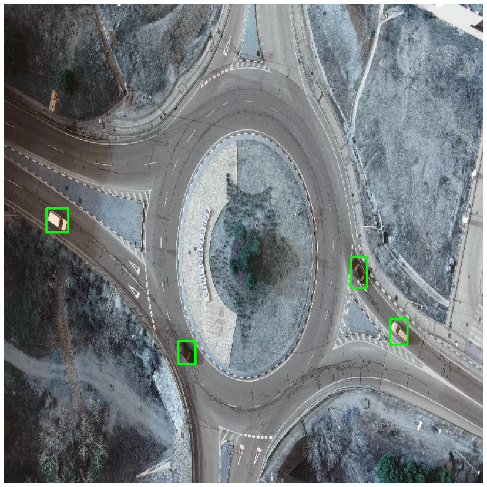

<!--
Copyright (c) 2021 - present / Neuralmagic, Inc. All Rights Reserved.

Licensed under the Apache License, Version 2.0 (the "License");
you may not use this file except in compliance with the License.
You may obtain a copy of the License at

   http://www.apache.org/licenses/LICENSE-2.0

Unless required by applicable law or agreed to in writing,
software distributed under the License is distributed on an "AS IS" BASIS,
WITHOUT WARRANTIES OR CONDITIONS OF ANY KIND, either express or implied.
See the License for the specific language governing permissions and
limitations under the License.
-->

# Sparse Transfer Learning

This page explains how to fine-tune a pre-sparsified YOLOv5 model with SparseML's CLI.

## Overview

Sparse Transfer is quite similiar to the typical YOLOv5 training, where we fine-tune a checkpoint pretrained on COCO onto a smaller downstream dataset. However, with Sparse Transfer Learning, we simply start the fine-tuning process from a pre-sparsified YOLOv5 and maintain sparsity while the training process occurs.

SparseZoo contains pre-sparsified checkpoints of each YOLOv5 model. These models can be used as the starting checkpoint for the sparse transfer learning workflow.

[Check out the full list of pre-sparsified YOLOv5 models](https://sparsezoo.neuralmagic.com/?domain=cv&sub_domain=detection&page=1)

## Installations

Install via `pip`:

```
pip install "sparseml[yolov5]"
```

## Table of Contents

In this page, you will:
- [Sparse Transfer Learn YOLOv5s onto VOC](#sparse-transfer-learning-yolov5s-onto-voc)
- [Sparse Transfer Learn Other YOLOv5 Models](#sparse-transfer-learning-other-yolov5-models)
- [Sparse Transfer Learn with a Custom Dataset](#sparse-transfer-learning-with-a-custom-dataset)

## SparseML CLI

The examples below will use SparseML's CLI, which is built on top of YOLOv5's [`train.py`](https://github.com/ultralytics/yolov5/wiki/Train-Custom-Data) script. 

This enables you to kick-off sparse training workflows with all of the friendly utilities from the friendly Ultralytics repo like dataset loading and preprocessing, checkpoint saving, metric reporting, and logging handled for you. Appending the `--help` argument will provide a full list of options for training in SparseML:

```bash
sparseml.yolov5.train --help
```

output:
```
usage: sparseml.yolov5.train [-h] [--weights WEIGHTS] [--cfg CFG] [--data DATA] [--hyp HYP] [--epochs EPOCHS] [--batch-size BATCH_SIZE] [--imgsz IMGSZ] [--rect]
                             [--resume [RESUME]] [--nosave] [--noval] [--noautoanchor] [--evolve [EVOLVE]] [--bucket BUCKET] [--cache [CACHE]] [--image-weights]
                             [--device DEVICE] [--multi-scale] [--single-cls] [--optimizer {SGD,Adam,AdamW}] [--sync-bn] [--workers WORKERS] [--project PROJECT]
                             [--name NAME] [--exist-ok] [--quad] [--cos-lr] [--label-smoothing LABEL_SMOOTHING] [--patience PATIENCE] [--freeze FREEZE [FREEZE ...]]
                             [--save-period SAVE_PERIOD] [--local_rank LOCAL_RANK] [--entity ENTITY] [--upload_dataset [UPLOAD_DATASET]]
                             [--bbox_interval BBOX_INTERVAL] [--artifact_alias ARTIFACT_ALIAS] [--recipe RECIPE] [--disable-ema] [--max-train-steps MAX_TRAIN_STEPS]
                             [--max-eval-steps MAX_EVAL_STEPS] [--one-shot] [--num-export-samples NUM_EXPORT_SAMPLES]

optional arguments:
  -h, --help            show this help message and exit
  --weights WEIGHTS     initial weights path
  --cfg CFG             model.yaml path
  --data DATA           dataset.yaml path
  --hyp HYP             hyperparameters path
  --epochs EPOCHS
  --batch-size BATCH_SIZE
                        total batch size for all GPUs, -1 for autobatch
...
```

SparseML inherits most arguments from the Ultralytics repository. [For more details, check out the YOLOv5 documentation](https://github.com/ultralytics/yolov5).

## Sparse Transfer Learning YOLOv5s onto VOC

Let's try a step-by-step example of Sparse Transfer Learning YOLOv5s onto the VOC dataset.

To run sparse transfer learning, we first need to create/select a sparsification recipe. For sparse transfer, we need a recipe that instructs SparseML to maintain sparsity during training and to quantize the model over the final epochs.

For the VOC dataset, there is a [transfer learning recipe available in SparseZoo](https://sparsezoo.neuralmagic.com/models/yolov5-x6-coco-pruned90_quantized?hardware=deepsparse-c6i.12xlarge&comparison=yolov5-x6-coco-base&tab=4), identified by the following stub:

```
zoo:cv/detection/yolov5-x6/pytorch/ultralytics/coco/pruned90_quant-none?recipe=transfer_learn
```

Here's what the transfer learning recipe looks like:

```yaml
version: 1.1.0

# General variables
num_epochs: 55
quantization_epochs: 5
quantization_lr: 1.e-5
final_lr: 1.e-9

training_modifiers:
  - !EpochRangeModifier
    start_epoch: 0
    end_epoch: eval(num_epochs)

  - !LearningRateFunctionModifier
    start_epoch: eval(num_epochs - quantization_epochs)
    end_epoch: eval(num_epochs)
    lr_func: cosine
    init_lr: eval(quantization_lr)
    final_lr: eval(final_lr)

pruning_modifiers:
  - !ConstantPruningModifier
    start_epoch: 0.0
    params: __ALL_PRUNABLE__

quantization_modifiers:
  - !QuantizationModifier
    start_epoch: eval(num_epochs - quantization_epochs)
    submodules:
      - model
    custom_quantizable_module_types: ['SiLU']
    exclude_module_types: ['SiLU']
    quantize_conv_activations: False
    disable_quantization_observer_epoch: eval(num_epochs - quantization_epochs + 2)
    freeze_bn_stats_epoch: eval(num_epochs - quantization_epochs + 1)
```

The "Modifiers" encode how SparseML should modify the training process for Sparse Transfer Learning.
- `ConstantPruningModifier` tells SparseML to pin weights at 0 over all epochs, maintaining the sparsity structure of the network
- `QuantizationModifier` tells SparseML to quantize the weights with quantization aware training over the last 5 epochs

SparseML parses the instructions declared in the recipe and modifies the YOLOv5 training loop accordingly before running the fine-tuning. 

Run the following:
```
sparseml.yolov5.train \
  --weights zoo:cv/detection/yolov5-s/pytorch/ultralytics/coco/pruned75_quant-none?recipe_type=transfer_learn \
  --recipe zoo:cv/detection/yolov5-s/pytorch/ultralytics/coco/pruned75_quant-none?recipe_type=transfer_learn \
  --data VOC.yaml \
  --patience 0 \
  --cfg yolov5s.yaml \
  --hyp hyps/hyp.finetune.yaml
```

Lets discuss the key arguments:
- `--weights` specifies the starting checkpoint for the training process. Here, we passed a SparseZoo stub, which
identifies the 75% pruned-quantized YOLOv5s model in the SparseZoo. The script downloads the PyTorch model to begin training. In addition to SparseZoo stubs, you can also pass a local path to a PyTorch checkpoint.

- `--recipe` specifies the transfer learning recipe. In this case, we passed a SparseZoo stub, which instructs SparseML to download the premade YOLOv5s transfer learning recipe shown above. In addition to SparseZoo stubs, you can also pass a local path to a YAML recipe. 

- `--data` specifies the dataset configuration. Here, we specify the VOC dataset, which is automatically downloaded. See below for an example
  using a custom dataset.
  
- `--hyps` specifies a path to the hyperparameters for the training. Here, we use a [built in configuration](https://github.com/neuralmagic/yolov5/blob/master/data/hyps/hyp.finetune.yaml) for fine-tuning. Note that any hyperparameters specified in the `--recipe` (e.g. epochs or learning rate) will override anything passed to the `--hyps` argument. For instance, in this case, the recipe specifies the learning rate schedule for QAT. The specification in the recipe overrides the `lr` in the hyperparameter file.

As a result, sparsity is maintained while the training occurs and we quantize the model over the final few epochs. In the end, we have a 75% pruned and quantized YOLOv5s trained on VOC!

### Exporting for Inference

Once trained, you can export the model to ONNX for inference with DeepSparse. 

Run the following:

```bash 
sparseml.yolov5.export_onnx \
  --weights yolov5_runs/train/exp/weights/last.pt \
  --dynamic
```

The resulting ONNX file is saved in your local directory.

## Sparse Transfer Learning Other YOLOv5 Models

Here are some sample transfer learning commands for other versions of YOLOv5. 

   - YOLOv5n Pruned-Quantized:
```bash
sparseml.yolov5.train \
   --cfg yolov5n.yaml \
   --weights zoo:cv/detection/yolov5-n/pytorch/ultralytics/coco/pruned40_quant-none?recipe_type=transfer_learn \
   --recipe zoo:cv/detection/yolov5-n/pytorch/ultralytics/coco/pruned40_quant-none?recipe_type=transfer_learn \
   --data VOC.yaml \
   --patience 0 \
   --hyp hyps/hyp.finetune.yaml
```
   - YOLOv5s Pruned-Quantized:
```bash
sparseml.yolov5.train \
  --cfg yolov5s.yaml \
  --weights zoo:cv/detection/yolov5-s/pytorch/ultralytics/coco/pruned75_quant-none?recipe_type=transfer_learn \
  --recipe zoo:cv/detection/yolov5-s/pytorch/ultralytics/coco/pruned75_quant-none?recipe_type=transfer_learn \
  --data VOC.yaml \
  --patience 0 \
  --hyp hyps/hyp.finetune.yaml
```
   - YOLOv5m Pruned-Quantized:
```bash
sparseml.yolov5.train \
  --cfg yolov5m.yaml \
  --weights zoo:cv/detection/yolov5-m/pytorch/ultralytics/coco/pruned70_quant-none?recipe_type=transfer_learn \
  --recipe zoo:cv/detection/yolov5-m/pytorch/ultralytics/coco/pruned70_quant-none?recipe_type=transfer_learn \
  --data VOC.yaml \
  --patience 0 \
  --hyp hyps/hyp.finetune.yaml
```
   - YOLOv5l Pruned-Quantized:
```bash
sparseml.yolov5.train \
  --cfg yolov5l.yaml \
  --weights zoo:cv/detection/yolov5-l/pytorch/ultralytics/coco/pruned90_quant-none?recipe_type=transfer_learn \
  --recipe zoo:cv/detection/yolov5-l/pytorch/ultralytics/coco/pruned90_quant-none?recipe_type=transfer_learn \
  --data VOC.yaml \
  --patience 0 \
  --hyp hyps/hyp.finetune.yaml
```
   - YOLOv5x Pruned-Quantized
```bash
sparseml.yolov5.train \
  --cfg yolov5x.yaml \
  --weights zoo:cv/detection/yolov5-x/pytorch/ultralytics/coco/pruned80_quant-none?recipe_type=transfer_learn \
  --recipe zoo:cv/detection/yolov5-x/pytorch/ultralytics/coco/pruned80_quant-none?recipe_type=transfer_learn \
  --data VOC.yaml \
  --patience 0 \
  --hyp hyps/hyp.finetune.yaml
```

SparseZoo contains mutliple variants of each version of YOLOv5 at various levels of sparsity, which can be fine-tuned onto your dataset. 

[Checkout the full list](https://sparsezoo.neuralmagic.com/?page=1&domain=cv&sub_domain=detection) 

## Sparse Transfer Learning with a Custom Dataset

Because SparseML is integrated with YOLOv5, we can easily pass custom datasets to the training flows in the Ultralytics format.

### Ultralytics Dataset Format 

There are three steps to creating a custom dataset for YOLOv5.

#### 1. Create `dataset.yaml`

Ultralytics uses a YAML file to pass a dataset configuration that defines:
- The dataset root directory `path` and relative paths to `train` / `val` / `test` image directories (or *.txt files with image paths)
- A class names dictionary

Here is an example for [COCO128](https://www.kaggle.com/datasets/ultralytics/coco128),
an example small tutorial dataset composed of the first 128 images in COCO train2017. These same 128 images are used for both training and validation to verify our training pipeline is capable of overfitting.

```yaml
# Train/val/test sets as 1) dir: path/to/imgs, 2) file: path/to/imgs.txt, or 3) list: [path/to/imgs1, path/to/imgs2, ..]
path: ./datasets/coco128  # dataset root dir
train: images/train2017  # train images (relative to 'path') 128 images
val: images/train2017  # val images (relative to 'path') 128 images
test:  # test images (optional)

# Classes (80 COCO classes)
names:
  0: person
  1: bicycle
  2: car
  ...
  77: teddy bear
  78: hair drier
  79: toothbrush
```

#### 2. Create Labels

After using a tool like [Roboflow Annotate](https://roboflow.com/annotate?ref=ultralytics) to label your data, export your labels to the YOLO Format, with one
`*.txt` file per image (if no objects are in the image, no `*.txt` file is required).

The `*.txt` file specifications are:
- One row per object
- Each row is `class x_center y_center width height` format.
- Box coordinates must be in normalized xywh format (from 0 - 1). If your boxes are in pixels, divide `x_center` and `width` by image width, and `y_center` and `height` by image height.
- Class numbers are zero-indexed (start from 0).


#### 3. Organize Directories 

Organize your train and val images and labels according to the example below. For the demo COCO128 file above,  assumes `/coco128` is inside a `/datasets` directory in your current directory. YOLOv5 locates labels automatically for each image by replacing the last instance of `/images/` in each image path with `/labels/`. For example:

```
./datasets/coco128/images/im0.jpg  # image
./datasets/coco128/labels/im0.txt  # label
```

For more details, checkout the [custom dataset set tutorial](https://github.com/ultralytics/yolov5/wiki/Train-Custom-Data) in the Ultralytics repository.

### Example

Let's try a real example with an aerial dataset.

#### Download the Dataset

The dataset is hosted on Google Drive ([link to file](https://drive.google.com/file/d/1GWTv9s-H387X-6wxHf2lVllqEdIv2J7N/view?usp=share_link)).

Install `gdown` and download/unzip the dataset:
```
pip install --upgrade gdown
gdown 1GWTv9s-H387X-6wxHf2lVllqEdIv2J7N
tar -xvf aerial-dataset.tar.gz
```

After unzipping, we can see the directory conforms to the Ultralytics format:
```
|-- aerial-dataset
  |--train
    |--images
      |--00001_frame000000_original.jpg
      ...
    |--labels
      |--00001_frame000000_original.txt
      ...
  |--val
    |--images
      |--00053_frame000000_original.jpg
      ...
    |--labels
      |--00053_frame000000_original.txt
      ...
```

Here is a sample label file for `aerial-dataset/train/labels/00001_frame000000_original.txt`:
```
0 0.719010 0.124074 0.022396 0.083333
0 0.943229 0.133333 0.039583 0.037037
0 0.787240 0.153241 0.042188 0.041667
0 0.741667 0.121759 0.017708 0.073148
0 0.693229 0.100463 0.017708 0.063889
0 0.670312 0.097222 0.025000 0.075926
0 0.648177 0.077315 0.022396 0.069444
0 0.619531 0.050463 0.022396 0.056481
0 0.492448 0.078704 0.039062 0.059259
0 0.418229 0.806019 0.034375 0.065741
0 0.349479 0.646296 0.018750 0.064815
0 0.461458 0.916204 0.037500 0.052778
```

Run the following to visualize the data:

```python
import pandas as pd
import numpy as np
import matplotlib.pyplot as plt
import random, cv2
from PIL import Image

plt.figure(figsize=(15, 15), facecolor='white')

filename_image = f"aerial-dataset/train/images/00001_frame000000_original.jpg"
filename_label = filename_image.replace('images','labels').replace('jpg','txt')
data = pd.read_csv(filename_label, header=None, delimiter=' ', names=["class", "x_center", "y_center", "width", "height"])

print(filename_image)
print(filename_label)
im = cv2.imread(filename_image)
im_size = im.shape[:2]
for _, bbox in data.iterrows():

  cls, xc, yc, w, h = bbox
  xmin = xc - w/2
  ymin = yc - h/2
  xmax = xc + w/2
  ymax = yc + h/2

  xmin *= im_size[1]
  ymin *= im_size[0]
  xmax *= im_size[1]
  ymax *= im_size[0]

  start_point = (int(xmin), int(ymin))
  end_point = (int(xmax), int(ymax))
  color = (0, 255, 0)
  thickness = 2

  im = cv2.rectangle(im, start_point, end_point, color, thickness)

plt.axis("off")
plt.imshow(im)
```



#### Create a Config

Save the following configuration file as `aerial-dataset.yaml`:

```yaml
# aerial-dataset.yaml
path: ./aerial-dataset
train:
  - train/images
val:
  - val/images

# Classes
nc: 1  # number of classes
names: ['object']
```

#### Run Transfer Learning

With the config file setup and data downloaded, we can simply swap in the dataset configuration file in place of the `VOC.yaml`.

```
sparseml.yolov5.train \
  --weights zoo:cv/detection/yolov5-s/pytorch/ultralytics/coco/pruned75_quant-none?recipe_type=transfer_learn \
  --recipe zoo:cv/detection/yolov5-s/pytorch/ultralytics/coco/pruned75_quant-none?recipe_type=transfer_learn \
  --recipe-args '{"num_epochs":30}' \
  --data aerial-dataset.yaml \
  --patience 0 \
  --cfg yolov5s.yaml \
  --hyp hyps/hyp.finetune.yaml
```

You will notice that we added a `--recipe_args` argument, which updates the transfer 
learning recipe to run for 30 epochs rather than 55 epochs. While you can always create
a custom recipe file and pass a local file to script, the `--recipe_args` enables you
to modify on the fly.

Feel free to adjust the hyperparameters as needed!

The model achieves ~80% mAP@50.

## Wrapping Up

Checkout [DeepSparse](https://github.com/neuralmagic/deepsparse) for more details on deploying your sparse models with GPU-class performance.
